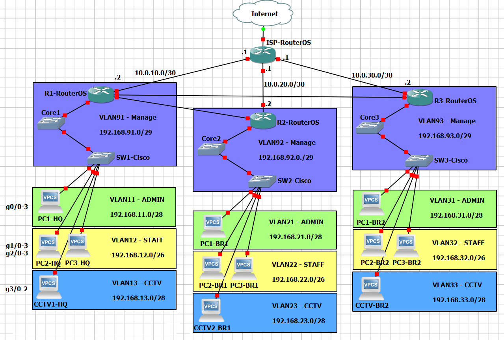

# 🔻پیاده‌سازی شبکه‌ی اداری - همراه با روتینگ داینامیک
##🔹محیط کار و توپولوژی


- **GNS3**⬆️


## 🔹هدف
>شرکت میخواد که "از روی اینترنت با شعبش ارتباط بگیره و بعد از ارتباط، روتینگ داینمیک داشته باشه، و داخل شرکت‌‌هم دوربین‌ها اینترنت نداشته باشن، تنظیمات امنیتی ساده‌ای وجود داشته باشه، برای VLANها سیاست وجود داشته باشه و...)
>	❌**این سناریو خراب شد**‼️

>شرکت میخواد که "از بر بستر سیمی با شعبش ارتباط بگیره و بعد از ارتباط، روتینگ داینمیک داشته باشه، و داخل شرکت‌‌هم دوربین‌ها اینترنت نداشته باشن، تنظیمات امنیتی ساده‌ای وجود داشته باشه، برای VLANها سیاست وجود داشته باشه و...)
>	✅**این سناریو جایگزین شد**‼️

- با **استفاده از** موارد زیر، شبکه و ارتباط بین شعب رو برای یک شرکت فراهم می‌کنیم؛ 
	
- اقدامات **Switch**ها:
	- اقدامات **کلی**:
		1. تعریف`VLAN`ها✅
			
	- اقدامات **امنیتی**:
		1. راه‌اندازی`DHCP Snooping`✅
		2. راه‌اندازی`Port Security`روی`Core`ها✅
			
	- اقدامات **پشتیبانی**:
		1. راه‌اندازی`SSH`✅
		
		
- اقدامات **Router**ها:
	اقدامات **کلی**:
		1. تعریفVLAN`ها✅
		2. راه‌اندازی`DHCP Server`✅
		3. تنظیم`Src-NAT`✅
		4. تنظیم`Default Route`✅
			
	اقدامات **امنیتی** و **سیاستی**:
		1. بستن`IP Service`ها✅
		2. بستن`SSH`/`WinBox`از`VLAN`های غیرADMIN✅
		3. تعریف`Src-NAT`بدون`CCTV VLAN`✅
		4. تعریف`Simple Queue`برای`VLAN`ها✅
			
	اقدامات **روتینگ**:
		1. راه‌اندازی`EoIP Tunnel`بین`R1`و`R2`✅‼️(انجام شد ولی لغو کردم)
		2. راه‌اندازی`Wiregurad`بین`R1`و`R3`✅‼️(انجام شد ولی لغو کردم)
		3. راه‌اندازی`OSPF`روی`Wiregurad`و`EoIP Tunnel`✅❌(انجام شد ولی مشکل داشت)
		* راه‌اندازی`OSPF`بر بستر **سیم**ی (Wired)✅
	
	
- **هدف** از این سناریو اینه که چیزایی که **تا اینجا** یاد گرفتیم رو **تا حد امکان** ترکیب کنیم و سناریویی درست کنیم که **بعده‌ها** بشه بهش برگشت و **آپدیت**ش کرد‼️


## 🔹اقدامات و کانفیگ‌ها
### 🔸سوئیچ‌های`SW`
![[SWs - VLANs & Access Ports.png]]
1. تعریف `VLAN`ها و اضافه کردن`Port`های`Access`⬆️


![[SWs - Mange VLAN & Trunk Port.png]]
2. ساخت `Mange VLAN`ها و تنظیم `Trunk Port`⬆️


![[SWs - DHCP Snooping.png]]
3. راه‌اندازی `DHCP Snooping`⬆️


![[SWs - SSH.png]]
4. راه‌اندازی`SSH`⬆️

### 🔸سوئیچ‌های`Core`
![[Cores - VLANs & Trunk Ports.png]]
1. تعریف `VLAN`ها و تنظیم `Trunk Port`ها⬆️


![[Cores - Manage VLAN.png]]
2. ساخت`Manage VLAN`⬆️ و بعدش⬇️
```sh
CoreX(config): vlan 9X
CoreX(config-vlan): name Manage
```
>این باعث میشه تا **واقعا** VLAN9X رو داشته باشیم و **مشکل**ی پیش نیاد‼️ 


![[Cores - DHCP Snooping.png]]
3. راه‌اندازی`DHCP Snooping`⬆️


![[Cores - Port Security.png]]
4. راه‌اندازی`Port Security`⬆️


![[Cores - SSH.png]]
5. راه‌اندازی`SSH`⬆️

### 🔸روترها
![[Routers - VLAN & IP Addresses.png]]
1. تعریف`VLAN`ها و آدرس‌دهی⬆️


![[Routers - DHCP Servers.png]]
2. راه‌اندازی`DHCP Server`برای هر`VLAN`⬆️


![[Routers - Default Route.png]]
3. تنظیم`Default Route`⬆️


###### 🔸🛑FAILD⬇️
![[Routers - EoIP Tunnel - R1 & R2.png]]
![[Routers - EoIP Tunnel - IP Addresses.png]]
4. راه‌اندازی`EoIP Tunnel`بین`R1`و`R2`؛ و تنظیم`IP Address`روشون⬆️

###### 🔸🛑FAILD⬇️
![[Routers - WireGuard - R1 & R3.png]]
![[Routers - WireGuard - IP Addresses.png]]
5. راه‌اندازی`Wireguard`بین`R1`و`R3`؛ و تنظیم`IP Address`روشون⬆️

###### 🔸🛑FAILD⬇️
![[Routers - OSPF - R1.png]]
![[Routers - OSPF - R2.png]]
![[Routers - OSPF - R3.png]]
6. راه‌اندازی`OSPF`⬆️


###### 🔸✅INSTEAD of FAILDs⬇️
![[Routers - OSPF (Wired) - (1).png]]
![[Routers - OSPF (Wired) - (2).png]]
![[Routers - OSPF (Wired) - (3).png]]
4. راه‌اندازی`OSPF`بر بستر Wired⬆️


![[Routers - Disable IP Services.png]]
5. بستن`IP Service`ها⬆️


![[Routers - Address List & Filter Rule.png]]
6. تعریف`Address List`ها و تنظیم`Filter Rule`برای`SSH`/`Winbox`⬆️


![[Routers - NAT (Except CCTV).png]]
7. تعریف`Src-NAT`بدون`CCTV VLAN`⬆️


![[Routers - Simple Queues.png]]
8. تعریف`Simple Queue`ها⬆️
>خیلی **کلی** تعریف کردم؛ چون`Simple Queue`برای کارهای خیلی زیاد ساخته **نشده**‼️


## 🔹راستی آزمایی
![[Ping - Inter-VLAN Routing.png]]
- تست Inter-VLAN Routing با دستور`ping`⬆️

![[ Enterprice Network LAB/Sources/Ping - OSPF.png]]
- تست Routing با دستور`ping`⬆️

![[Ping - Internet Access.png]]
- تست دسترسی به اینترنت با دستور`ping`⬆️


## 🔹مشکل
1. **مشکل** اول بازم این بود که **کلاینت‌‌‌ها** IP نمیگرفتن و سر همینم نمیتونستم چیزی رو تست کنم🛑
	
	- **راه‌حل**‌ش هم یکم **بررسی** بود و فهمیدم که `SW`ها **کانفیگ‌ها**شون میپره (با اینکه`wr`یا`copy run sta`میزدم!)؛ **دوباره** کانفیگ کردم✅
	
	
2. **مشکل** دوم این بود`EoIP Tunnel`م و`WireGuard`م قطع و وصل میشدن و باعث میشد تا` OSPF`م هم قطع و وصل بشه؛ روی هم کلا روتینگ رو **خراب** میکردن🛑
	
	- **نکته**‌ش این بود که با یک Tunnel دیگه (مثلا GRE) **تست** کنم؛ و بعد از تست **فهمیدم** که کلا`OSPF` روی بستر Tunnel داخل GNS3 این **مشکلات** رو داره‼️
		
	- **راه‌‌حل**ش هم این بود که بیخیال ایده Tunnel بشم و عادی انجامش بدم✅


## 🔹نتیجه
---
>سناریو **موفقیت‌آمیز** بود✅

- *همراه با کلی دردسر و تجربیات جدید‼️*
---
